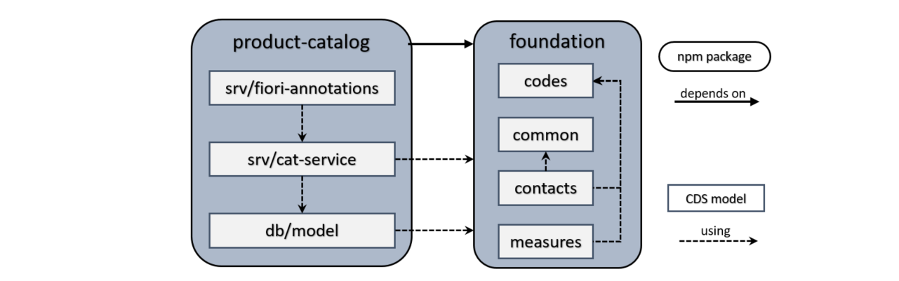

## Samples for the Application Programming Model for SAP Cloud Platform

The following samples give you more hands-on practice with the [application programming model for SAP Cloud Platform](https://help.sap.com/viewer//65de2977205c403bbc107264b8eccf4b/Cloud/en-US/00823f91779d4d42aa29a498e0535cdf.html):

* Part 1 - [Foundation](https://github.com/SAP/cloud-samples-foundation/tree/rel-1.0)
* Part 2 - Product Catalog (current repository)
* Part 3 - [ITelO Catalog](https://github.com/SAP/cloud-samples-itelo/tree/rel-1.0)

### Part 2 - Product Catalog (Reuse Scenario)

The Product Catalog shows a sample business application, developed by reusing the CDS models from [Foundation](https://github.com/SAP/cloud-samples-foundation/tree/rel-1.0).

The application allows a user to create, delete and modify products of a product catalog.

Technically the sample consists of:

* a CDS model (find more information [here](https://help.sap.com/viewer//65de2977205c403bbc107264b8eccf4b/Cloud/en-US/855e00bd559742a3b8276fbed4af1008.html))
* an automatic Java OData V2 exposure extended by individual business logic (find more information [here](https://help.sap.com/viewer//65de2977205c403bbc107264b8eccf4b/Cloud/en-US/68af515a26d944c38d81fd92ad33681e.html))
* a UI based on SAP Fiori elements (find more information [here](https://help.sap.com//SAPUI5_PDF/SAPUI5.pdf)).

This application is only an example and not intended for productive use.

### Component Overview

## Requirements

SAP Web IDE Full-Stack access is needed. For more information, see [Open SAP Web IDE](https://help.sap.com/viewer/825270ffffe74d9f988a0f0066ad59f0/CF/en-US/51321a804b1a4935b0ab7255447f5f84.html).

## Development in SAP Cloud Platform Web IDE

Read the [getting started tutorial](https://help.sap.com/viewer//65de2977205c403bbc107264b8eccf4b/Cloud/en-US/5ec8c983a0bf43b4a13186fcf59015fc.html) to learn more about working with SAP Cloud Platform Web IDE.

Now clone your fork of this repository (*File -> Git -> Clone Repository*).

### Develop, Build, Deploy

To build and deploy your application or modify it and redeploy, use any of the following options:

* Build and deploy the DB module by choosing *Build* from the context menu of the db folder.

* Build and deploy the Java service by choosing *Run -> Run as -> Java application* from the context menu of the srv folder. To test the service, click the URL displayed in the Run Console. Use the endpoint of the service *clouds.products.CatalogService* to call $metadata or CRUD requests.

* Test the UI by choosing *Run -> Run as -> SAP Fiori Launchpad Sandbox* from the context menu of the app folder. Click on the app tile to launch the application.

## Known Issues

* The read only field _Availability_ is enabled occasionally when creating a new Product.

## Support

This project is provided "as-is": there is no guarantee that raised issues will be answered or addressed in future releases.

## License

Copyright (c) 2018 SAP SE or an SAP affiliate company. All rights reserved.
This project is licensed under the Apache Software License, Version 2.0 except as noted otherwise in the [LICENSE](LICENSE) file.
